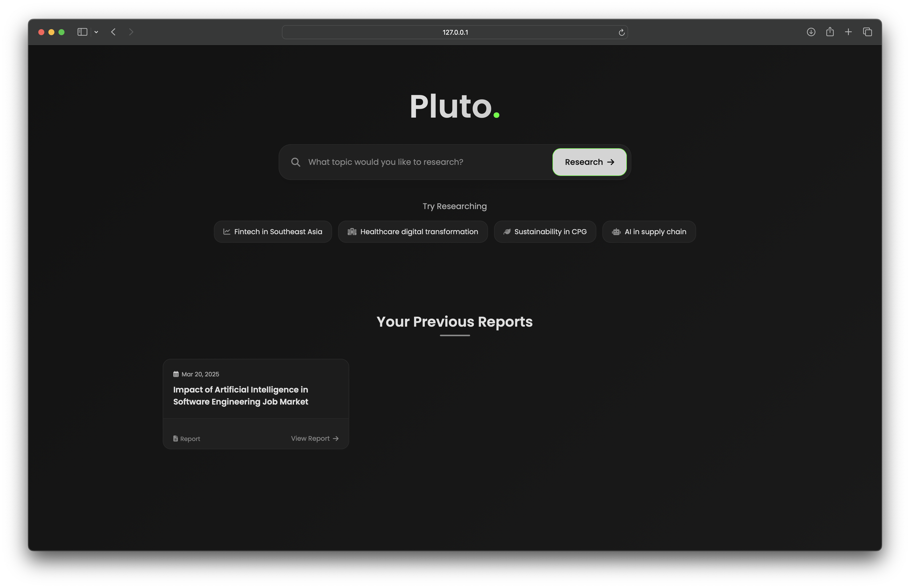

# Pluto



Pluto is an AI-powered research assistant that generates consultant-grade strategic reports on any business topic. It combines web research, natural language processing, and AI synthesis to produce comprehensive, well-structured reports in minutes.

## Features

-   **Automated Research**: Searches the web for relevant information on your query
-   **Real-time Progress Tracking**: Watch as Pluto researches your topic with live updates
-   **Consultant-Grade Reports**: Structured reports with executive summaries, strategic analysis, and recommendations
-   **Report History**: Access your previously generated reports
-   **Export Options**: Download reports as Markdown or print directly from the browser

## Technology Stack

-   **Backend**: Python with Flask
-   **Frontend**: HTML, CSS, JavaScript
-   **AI Integration**: OpenAI API (for embeddings), OpenRouter API (for accessing LLMs)
-   **Web Scraping**: Trafilatura, Google Search
-   **Vector Store**: Chroma DB


## Installation

1.  Clone the repository:
    
    ```bash
    git clone https://github.com/thevoxium/Pluto.git
    cd Pluto
    
    ```
    
2.  (optional) Create and activate a virtual environment:
    
    ```bash
    python -m venv venv
    source venv/bin/activate  # On Windows: venv\Scripts\activate
    
    ```
    
3.  Install the required packages:
    
    ```bash
    pip install -r requirements.txt
    
    ```
    
4.  Set up environment variables:
    
    Create a `.env` file in the root directory with the following:
    
    ```
    OPENAI=your_openai_api_key
    OPENROUTER_API_KEY=your_openrouter_api_key
    
    ```
    
    (Recommended) Or set them directly in your environment:
    
    ```bash
    # On Linux/Mac
    export OPENAI=your_openai_api_key
    export OPENROUTER_API_KEY=your_openrouter_api_key
    
    # On Windows
    set OPENAI=your_openai_api_key
    set OPENROUTER_API_KEY=your_openrouter_api_key
    
    ```
    

## Running the Application

1.  Start the Flask application:
    
    ```bash
    python app.py
    
    ```
    
2.  Open your browser and navigate to:
    
    ```
    http://127.0.0.1:5000/
    
    ```
    


    -   `main.js`: Client-side functionality

## API Keys

### OpenAI API

1.  Go to [OpenAI's platform](https://platform.openai.com/)
2.  Sign up or log in to your account
3.  Navigate to the API section
4.  Generate a new API key
5.  Copy the key and add it to your environment variables

### OpenRouter API

1.  Visit [OpenRouter](https://openrouter.ai/)
2.  Create an account or sign in
3.  Navigate to the dashboard
4.  Generate a new API key
5.  Copy the key and add it to your environment variables


## Usage

1.  Enter your research topic in the search box on the homepage
2.  Click "Research" to begin the report generation process
3.  Watch as Pluto searches for relevant sources and analyzes the information
4.  Once complete, view your report directly in the interface
5.  Download the report as Markdown or copy it to your clipboard
6.  Access previously generated reports from the history section on the homepage

## Customization

You can customize the report generation process by modifying the `ConsultantReportGenerator` class in `generatereport.py`:

-   Adjust the number of search queries by changing `MAX_SEARCH_SUGGESTIONS`
-   Modify results per query with `RESULTS_PER_SUGGESTION`
-   Change the content chunking parameters with `CHUNK_SIZE` and `CHUNK_OVERLAP`

## License

MIT

## Acknowledgements

-   OpenAI for embeddings
-   OpenRouter for LLM access
-   The Flask and LangChain communities
